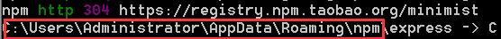

## 1. 安装项目生成器
```
npm install -g express-generator
```
> 如果安装以后执行express命令报错，则需要把express命令所在的目录添加到环境变量PATH中去


> 在命令提示符中输入path命令，即可查看当前配置的环境变量

## 2. 生成项目
```
express -e 201606blog
```

## 3. 进入项目目录并安装依赖
```
cd 201606blog && npm install 
```

## 4.启动项目
```
npm start
```

## 5. 配置**.gitignore**文件
```
node_modules 
lib
.idea
```

> 这些文件都不需要提交到github服务器

- node_modules 是npm 安装时依赖的模块
- lib 是我们将要把前端框架如jquery安装的目录
- .idea 是webstorm的配置文件


